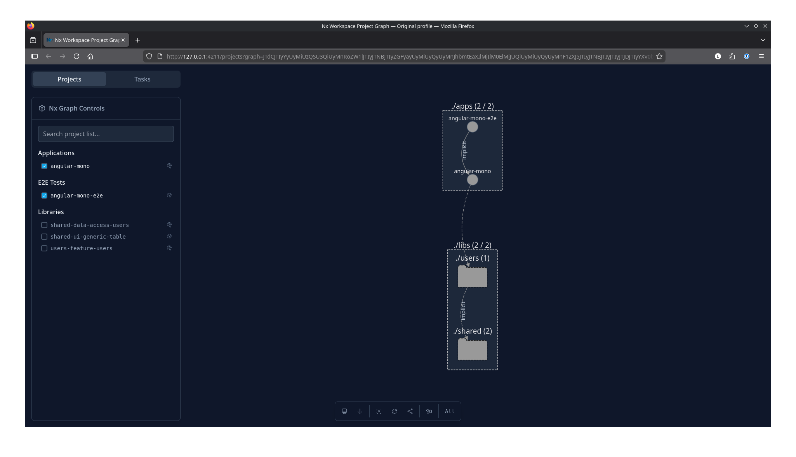

# Modern Angular Enterprise Sandbox

This project is a deep-dive exploration into building scalable, maintainable, and highly reactive web applications using the **Angular** ecosystem and **Nx** Monorepo architecture.

## 🎯 Learning Objectives

The primary goal of this repository is to master the intersection of enterprise architecture and reactive programming. Key focus areas include:

- **Nx Monorepo Architecture:** Implementing the "Enterprise Pattern" by splitting the application into specialized libraries: `feature`, `ui`, `data-access`, and `util`.
- **Reactive Orchestration:** Solving complex UI workflows (like gated API streams and state synchronization) using **RxJS** and **Angular Signals**.
- **Component Design:** Building high-leverage "Dumb" components (like the `GenericTable`) that are decoupled from domain logic via dependency injection and content projection.
- **Performance & Scalability:** Implementing route-level **Lazy Loading** and standardizing "Public APIs" for every library via `index.ts` entry points.

## 🛠️ The Tech Stack

- **Framework:** Angular 21 (with Signals and Standalone components).
- **Build System:** [Nx](https://nx.dev) for workspace management and dependency graphing.
- **Styling & UI:** Angular Material (CDK) integrated into custom generic wrappers.
- **State Management:** Reactive streams with RxJS `BehaviorSubject`, `combineLatest`, and `merge`.

## 🚀 Key Features Implemented

- **Generic Data Table:** A headless-style wrapper around `MatTable` featuring a "gated" search engine that prevents redundant API calls.
- **Lazy-Loaded Modules:** Clean separation of features to optimize initial bundle size.
- **Strict Typing:** Domain-driven interfaces shared across the workspace to ensure type safety from the API service to the UI template.

## 📍Architecture Overview

